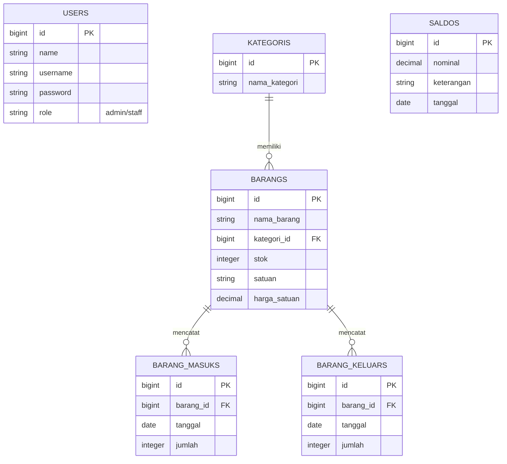

# InvenTrack - Sistem Manajemen Inventaris & Keuangan

**InvenTrack** adalah aplikasi manajemen inventaris barang dan keuangan (saldo/arus kas) berbasis web yang dirancang menggunakan framework **Laravel 12** dan **Tailwind CSS v4**. Sistem ini memungkinkan pengguna untuk memantau stok barang, mencatat riwayat barang masuk/keluar secara real-time, serta mengelola saldo kas perusahaan yang terintegrasi dengan transaksi inventaris.

---

## 🚀 Fitur Utama

1. **Dashboard Informatif & Dinamis**
   - Ringkasan total jenis barang.
   - Deteksi otomatis barang dengan stok menipis (stok $\le$ 5).
   - Akumulasi kuantitas dan nominal barang masuk (pembelian) & barang keluar (penjualan) bulan ini.
   - Grafik riwayat aktivitas transaksi barang harian (7 hari terakhir).
2. **Manajemen Barang & Kategori (CRUD)**
   - Mengelompokkan barang berdasarkan kategori (seperti Elektronik, ATK, Furnitur).
   - Informasi detail barang meliputi nama, satuan, stok saat ini, dan harga satuan.
3. **Pencatatan Transaksi Inventaris**
   - **Barang Masuk**: Mencatat pasokan barang baru yang dibeli (mengurangi saldo keuangan).
   - **Barang Keluar**: Mencatat pengeluaran/penjualan barang (menambah saldo keuangan).
4. **Manajemen Saldo (Ledger Keuangan)**
   - Menampilkan total deposit/top-up saldo kas.
   - Laporan ledger terpadu menggabungkan riwayat top-up, nominal pembelian barang masuk, dan nominal penjualan barang keluar secara kronologis.
   - Penghitungan saldo aktif berjalan (*running balance*).
5. **Manajemen Pengguna (Multi-Role)**
   - **Admin**: Akses penuh ke seluruh sistem termasuk kelola user, hapus data, dan top-up saldo.
   - **Staff Gudang**: Akses terbatas untuk pencatatan barang masuk/keluar serta melihat data inventaris.

---

## 🛠️ Stack Teknologi

- **Backend**: PHP $\ge$ 8.2 & Laravel 12
- **Frontend**: Blade Templating, Tailwind CSS v4 (melalui `@tailwindcss/vite`), & Vite
- **Database**: SQLite (default untuk kemudahan portabilitas pengembangan)
- **Task Runner/Dev Server**: `concurrently` untuk menjalankan multi-process secara bersamaan

---

## 📊 Skema Database & Relasi

Aplikasi ini memiliki 6 entitas utama di dalam database:



---

## ⚙️ Cara Instalasi & Menjalankan Project

Project ini sudah dilengkapi dengan *custom scripts* di dalam `composer.json` untuk mempermudah proses instalasi dan pengembangan.

### 1. Prasyarat
Pastikan komputer Anda sudah terinstal:
- PHP $\ge$ 8.2
- Composer
- Node.js & NPM

### 2. Setup Pertama Kali
Buka terminal di direktori project dan jalankan perintah:
```bash
composer run setup
```
Perintah di atas secara otomatis akan:
- Menginstal dependensi PHP via Composer (`composer install`).
- Menyalin berkas konfigurasi `.env.example` menjadi `.env`.
- Membuat kunci aplikasi baru (`php artisan key:generate`).
- Menjalankan migrasi database (`php artisan migrate --force`).
- Menginstal dependensi frontend via NPM (`npm install`).
- Melakukan kompilasi aset frontend (`npm run build`).

### 3. Menjalankan Server Pengembangan (Local Dev)
Untuk menjalankan aplikasi secara lokal, jalankan perintah berikut:
```bash
composer run dev
```
Perintah ini menggunakan `concurrently` untuk menjalankan beberapa *process* sekaligus secara bersamaan dalam satu terminal:
- Server Laravel (`php artisan serve`)
- Queue listener (`php artisan queue:listen`)
- Log Pail viewer (`php artisan pail`)
- Vite Dev Server (`npm run dev`)

Akses aplikasi melalui browser di: `http://127.0.0.1:8000`

### 4. Menjalankan Pengujian (Testing)
Untuk menjalankan unit/feature testing:
```bash
composer run test
```

---

## 🔑 Akun Uji Coba (Default Seeders)

Saat database selesai dimigrasi dan di-seed, terdapat dua akun bawaan yang bisa digunakan untuk login:

| Role | Username | Password |
| :--- | :--- | :--- |
| **Admin** | `admin` | `password` |
| **Staff Gudang** | `staff` | `password` |

---

## 🔍 Catatan Analisis Developer (Penting)

Berdasarkan analisis struktur kode saat ini, terdapat panggilan fungsi di [SaldoController.php](file:///d:/SEMESTER%206/Layanan%20Web/InvenTrack/app/Http/Controllers/SaldoController.php#L23):
```php
$runningSaldo = Saldo::getRunningSaldo();
```
Namun, method static `getRunningSaldo()` **belum terdefinisi** di dalam model [Saldo.php](file:///d:/SEMESTER%206/Layanan%20Web/InvenTrack/app/Models/Saldo.php). 

### Solusi Rekomendasi
Untuk mencegah error saat mengakses halaman Saldo, silakan tambahkan method berikut ke dalam file [app/Models/Saldo.php](file:///d:/SEMESTER%206/Layanan%20Web/InvenTrack/app/Models/Saldo.php):

```php
public static function getRunningSaldo()
{
    // 1. Total top-up saldo masuk manual
    $totalTopup = self::sum('nominal') ?? 0;

    // 2. Total pengeluaran kas (pembelian barang masuk)
    $totalPembelian = \App\Models\BarangMasuk::join('barangs', 'barang_masuks.barang_id', '=', 'barangs.id')
        ->selectRaw('SUM(barang_masuks.jumlah * barangs.harga_satuan) as total')
        ->value('total') ?? 0;

    // 3. Total pemasukan kas (penjualan barang keluar)
    $totalPenjualan = \App\Models\BarangKeluar::join('barangs', 'barang_keluars.barang_id', '=', 'barangs.id')
        ->selectRaw('SUM(barang_keluars.jumlah * barangs.harga_satuan) as total')
        ->value('total') ?? 0;

    // Saldo Berjalan = Topup - Pembelian + Penjualan
    return $totalTopup - $totalPembelian + $totalPenjualan;
}
```
---

